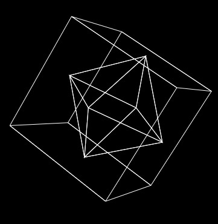

# 3D drawing on 2D HTML canvas

This little visualization shows how to draw 3D objects on a 2D HTML canvas with JavaScript (resp. TypeScript). We mainly use the projection `(x,y,z) -> (x/(1+z),y/(1+z))` with some embellishments.

https://3dmesh.netlify.app/

